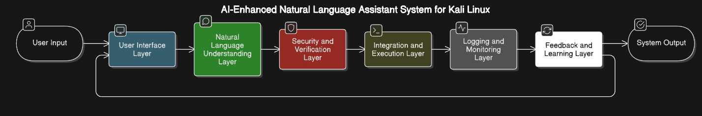
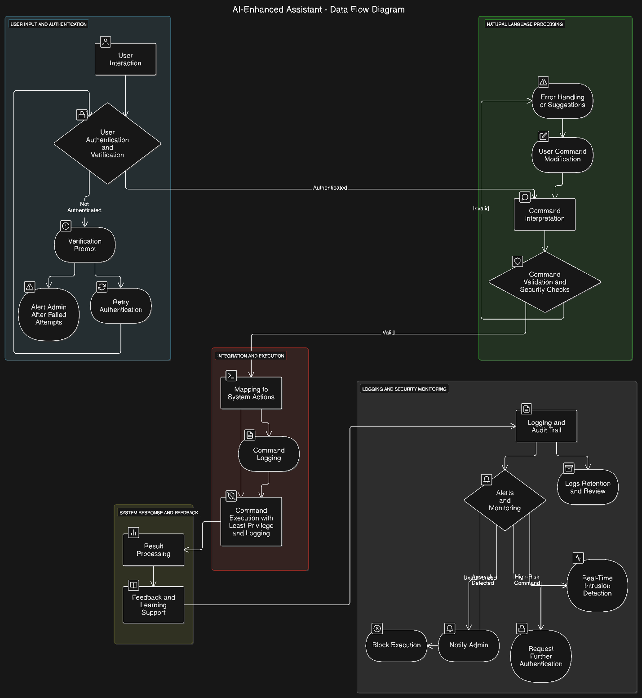
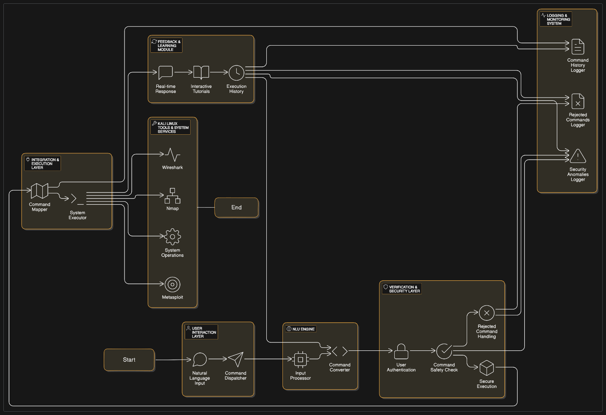
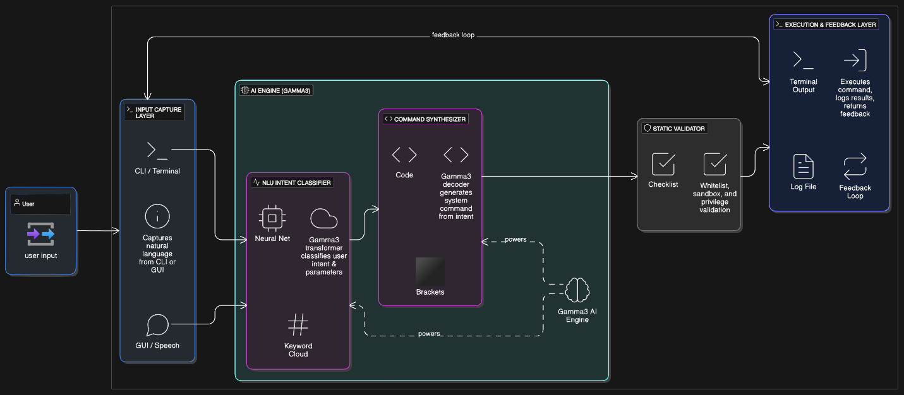
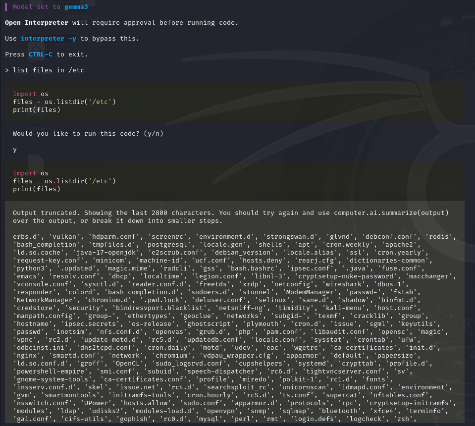
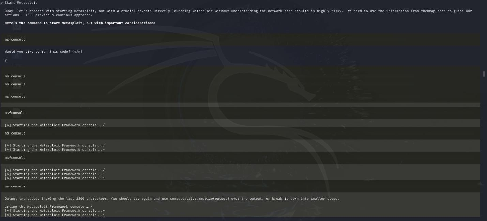

# AI-Enhanced Natural Language Assistant for Kali Linux

> **Final Year Project** — BSc (Hons) Cyber Security & Forensics  
> Global College of Engineering and Technology (GCET), Muscat, Oman (2025)  
> ⭐ **Recognized as one of the best final year projects at GCET**

---

## 📋 Table of Contents
- [Overview](#overview)
- [Key Results](#key-results)
- [Architecture](#architecture)
- [Demo Screenshots](#demo-screenshots)
- [Tech Stack](#tech-stack)
- [Methodology](#methodology)
- [Installation & Setup](#installation--setup)
- [Usage](#usage)
- [Limitations & Future Work](#limitations--future-work)
- [Full Report](#full-report)
- [Author](#author)

---

## Overview

Kali Linux's CLI is powerful but has a steep learning curve for beginners and creates friction for experts. This project embeds an **AI natural-language assistant** directly into Kali Linux, using Open Interpreter as the execution engine and a locally fine-tuned Gemma 3 model.

**Key Innovation:** Users describe security tasks in plain English. The AI interprets intent, validates commands, executes them safely in a sandbox, and provides real-time educational explanations—turning Kali from a tool you memorize into an interactive learning partner.

---

## Key Results

| Metric | Result | Target |
|--------|--------|--------|
| **Command Generation Accuracy** | 97.6% | 90% |
| **Execution Success Rate** | 96.3% | — |
| **Intent Recognition Accuracy** | 91.2% | 80% |
| **Threat Detection Accuracy** | 99.2–100% | — |
| **Task Completion Time Reduction** | 35% faster | — |
| **Beginner Learning Curve** | 89% error reduction | — |
| **User Satisfaction** | 42% increase | — |

**Concrete Example:** Beginners completed basic Nmap network scans in **under 45 minutes** vs. 2–3 hours with traditional CLI.

---

## Architecture

### High-Level System Design
The system is built as five interconnected layers, each handling a specific responsibility:



1. **User Interaction Layer** (Teal) — Accepts natural language via CLI or GUI
2. **Natural Language Understanding Engine** (Green) — Fine-tuned Gemma 3 classifies intent and extracts entities
3. **Verification & Security Layer** (Red) — Validates commands against a whitelist/sandbox policy
4. **Integration & Execution Layer** (Brown) — Maps commands to Kali tools via Python subprocess
5. **Logging & Monitoring Layer** (Dark Gray) — Tracks all actions, detects anomalies, alerts admins

### Data Flow Diagram
Shows how user input flows through authentication, NLP processing, security checks, execution, and feedback:



### Complete Framework Architecture
End-to-end workflow showing the five-layer system processing a user command:



### AI Agent Internal Architecture
Detailed look at the NLP engine layer—how Gemma 3 classifies intent, the command synthesizer, and static validation:



---

## Demo Screenshots

### Demo 1: Listing System Files
The assistant interprets "list files in /etc" and safely executes the command:



### Demo 2: Metasploit Guidance
The assistant provides cautionary context before launching Metasploit:



---

## Tech Stack

### Core Technologies
| Component | Technology | Notes |
|-----------|-----------|-------|
| **Language** | Python 3.9+ | Main development language |
| **NLP** | spaCy, NLTK | Intent classification & entity extraction |
| **LLM** | Gemma 3 (8-bit quantized) | Locally fine-tuned for ~1.6GB footprint |
| **Execution Engine** | Open Interpreter | Sandboxed subprocess execution |
| **Security** | OAuth 2.0, JWT | User authentication & session management |
| **Data Storage** | PostgreSQL + MongoDB | Structured logs + unstructured session data |
| **Monitoring** | ELK Stack, Prometheus | Real-time alerts and audit trails |

### Dependencies
```bash
pip install open-interpreter gemma-3 spacy nltk torch
python -m spacy download en_core_web_sm
```

---

## Methodology

### Approach
- **Framework:** Agile with mixed-methods evaluation
- **User Validation:** Semi-structured interviews with 10 Kali users (beginners & intermediate)
- **Quantitative Evaluation:** 10 representative security tasks on isolated VM
- **Metrics Collected:** Accuracy, execution time, user satisfaction, error rates

### Evaluation Tasks
1. Network reconnaissance (Nmap scans)
2. Vulnerability scanning (Nessus automation)
3. Exploit database queries (Metasploit)
4. Packet analysis (Wireshark)
5. Password cracking requests (hashcat)
6. Log analysis (grep + regex)
7. Traffic filtering (iptables)
8. Certificate generation (OpenSSL)
9. Wireless testing (airmon-ng)
10. Reverse shell setup (netcat)

---

## Installation & Setup

### Prerequisites
- Kali Linux 2024.x or later (or Ubuntu 22.04 with Kali tools)
- Python 3.9+
- 2GB RAM (minimum; 4GB recommended for Gemma 3)

### Quick Start

```bash
# Clone the repository
git clone https://github.com/AhmedAlmeligy/kali-ai-security-assistant.git
cd kali-ai-security-assistant

# Install dependencies
pip install -r requirements.txt
python -m spacy download en_core_web_sm

# Run the assistant
python assistant.py
```

---

## Usage

### Command Examples

```bash
# Network reconnaissance
> perform a TCP SYN scan on 192.168.1.0/24 for ports 80,443,22

# Vulnerability assessment
> check this website for SQL injection vulnerabilities

# Exploit exploration
> find public exploits for Apache 2.4.41

# Educational queries
> explain how ARP spoofing works
```

### Safety & Controls

- **Whitelisting:** Commands validated against a curated tool list
- **Sandboxing:** All subprocess calls run with restricted privileges
- **Rate Limiting:** Prevents command spam; logs suspicious patterns
- **Audit Trail:** Every action logged with timestamp, user, command, result

---

## Limitations & Future Work

### Known Limitations
- Gemma 3 requires ~1.6GB RAM—tight on low-end devices
- Complex multi-part commands can be misinterpreted
- Currently covers core subset of Kali tools (not yet Burp Suite, John, SQLmap)
- Small evaluation cohort (10 users)
- Text-only input (no voice)

### Future Roadmap

**Near-term (6 months):**
- [ ] Expand tool coverage (John, SQLmap, Hashcat integration)
- [ ] Voice-to-text input & speech synthesis
- [ ] Multi-language support (Arabic, French, Spanish)

**Medium-term (12 months):**
- [ ] Plugin ecosystem for custom tools
- [ ] Adaptive difficulty levels (beginner → expert)
- [ ] Active Directory attack scenarios
- [ ] Real-time collaborative labs

**Long-term:**
- [ ] Hybrid cloud-edge deployment
- [ ] SIEM platform integration (Splunk, ELK)
- [ ] Automated CTF challenge generation

---

## Full Report

The complete 104-page final year project report is available here:
- **PDF:** [21039296_Final_report.pdf](./assets/21039296_Final_report.pdf)

Contains full methodology, experimental design, result analysis, and academic references.

---

## Author

**Ahmed Osama Almeligy**  
Cyber Security & Forensics Graduate | Muscat, Oman

📧 **Email:** [ahmedalmeligy2108@gmail.com](mailto:ahmedalmeligy2108@gmail.com)  
💼 **LinkedIn:** [ahmed-al-meligy-89b16729b](https://www.linkedin.com/in/ahmed-al-meligy-89b16729b)  
🐙 **GitHub:** [@AhmedAlmeligy](https://github.com/AhmedAlmeligy)

---

## License

Educational & research purposes. See LICENSE for details.

## Acknowledgments

- GCET Faculty for guidance
- Open Interpreter project
- Gemma team
- Kali Linux community

---

**Last Updated:** September 2025  
**Status:** ⭐ Final Year Project Complete